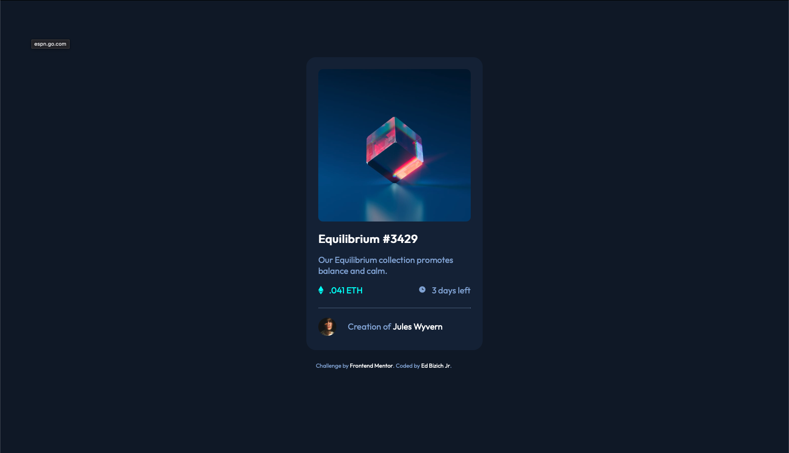

# Frontend Mentor - NFT preview card component solution

This is a solution to the [NFT preview card component challenge on Frontend Mentor](https://www.frontendmentor.io/challenges/nft-preview-card-component-SbdUL_w0U). Frontend Mentor challenges help you improve your coding skills by building realistic projects.

## Table of contents

- [Overview](#overview)
  - [The challenge](#the-challenge)
  - [Screenshot](#screenshot)
  - [Links](#links)
- [My process](#my-process)
  - [Built with](#built-with)
  - [What I learned](#what-i-learned)
  - [Continued development](#continued-development)
- [Author](#author)

## Overview

To take the files provided to match the final product without prewritten code.

### The challenge

Users should be able to:

- View the optimal layout depending on their device's screen size
- See hover states for interactive elements

### Screenshot

### Links

- Solution URL: [Add solution URL here](https://your-solution-url.com)
- Live Site URL: [Add live site URL here](https://your-live-site-url.com)

## My process

Since this was my first approach doing something with HTML and CSS. I started by breaking everything out in HTML and struggled with how many div classes and id's to use. After i had things broken out i was able to style it with CSS which made me make a few more classes that i missed.

### Built with

-html
-CSS

### What I learned

I learned to start thinking on how to break out this project piece by piece.  More about CSS properties and how i need more work with overlays.

### Continued development

Some things i am still needing work is when to use ID and Class for Divs. Also how many divs do you want to use in your page.  CSS tricked me up on the image and centering the parts with them. I can still use work in CSS.

## Author

- Website - [Ed Bizich Jr(https://www.edbizichjr.com)
- Frontend Mentor - [@edbizichjr(https://www.frontendmentor.io/profile/edbizichjr)
